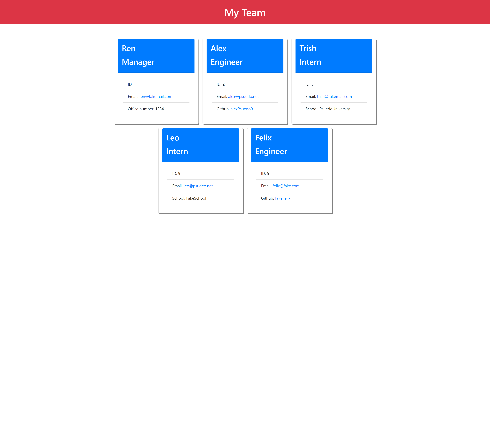

# Team Profile Generator

## Description

A Node.js command-line application that generates a HTML webpage displaying information about employees on a software engineering team.

Through the command line, users are given prompts to answers prompt to get employee information. First, the user are asked to input the manager's information (name, id, email, office number). After, the user inputs information for the remaining employees whether they are engineers (with name, id, email, github) or interns (with name, id, email, school). Each time the user gives all of the information about an employee, an object is created with the class call Manager/Engineer/Intern and all information are stored into the object and the object is pushed onto an array that will carry over to the html generator.

Using the information from the array, the generator makes a html file and puts the team profile information into the team profile section of the file.

## Table of Content

- [Description](#description)
- [Installation](#installation)
- [Usage](#usage)
- [Demo](#demo)
- [Screenshot](#screenshot)
- [Tests](#test)
- [Questions](#questions)

## Installation

- Download the zip files or clone/fork from https://github.com/ptran77/team-profile-generator
- from the command line, run 'npm i' to install the necessary packages

## Usage

- type and enter 'node index' to run the program
- answer the prompts and a html file will be generated
- the generated HTML will be in the dist folder

## Demo

[Demo Link](https://drive.google.com/file/d/1qJ3cuyYHyTy4zdZ2Q3Fy8oml6oiJC9Yj/view?usp=sharing)

## Screenshot

## Test

- tests are in the '\_\_test\_\_' folder
- type and enter 'npm test' to run tests

## Questions

Github: [ptran77](https://github.com/ptran77)

For any questions, contact me at pettran866@gmail.com
